# AI-Powered IT Service Management Portal
## Presentation Slides - 8 Slides Content

---

## Slide 1: Title Slide

**Title:**
AI-Powered IT Service Management Portal

**Subtitle:**
An Enterprise-Grade Intelligent Ticketing System

**Additional Information:**
- [Your Name]
- [Your College/University]
- [Date]
- [Course/Subject]

**Visual Element:**

*Note: Add hero image showing AI-powered IT service management portal with modern interface, AI brain icon, and ticketing system visualization*

---

## Slide 2: Abstract

**Slide Title:** Abstract

**Bullet Points:**
- Modern IT service management faces challenges with increasing ticket volumes and manual processes
- Traditional systems rely on manual classification, leading to delays and poor satisfaction
- **Proposed Solution**: AI-powered portal with NLP classification and intelligent automation
- **Key Features**: Multi-channel integration (web, mobile, email, GLPI, Solman), AI-driven routing, self-service chatbot, auto-resolution workflows
- **Impact**: Faster response times, improved resolution rates (40-60% reduction in manual work), reduced operational costs
- **Innovation**: Leverages AI and automation to transform IT support from reactive to proactive

**Visual Element:**

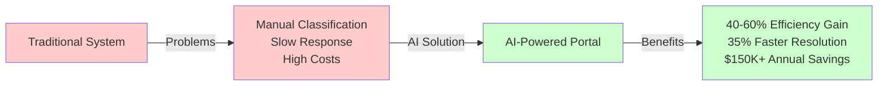

*Note: Add before/after comparison visual showing traditional system problems transforming into AI solution benefits*

**Key Talking Points:**
- Problem: Manual processes don't scale with growing ticket volumes
- Solution: AI automation transforms IT support operations
- Innovation: Multi-channel integration with intelligent automation
- Impact: Significant improvements in efficiency and user satisfaction

---

## Slide 3: Existing System

**Slide Title:** Existing System - Limitations

**Bullet Points:**
- **Manual Ticket Classification**: Time-consuming, error-prone, inconsistent across agents
- **Rule-Based Routing Only**: Static rules cannot adapt to workload, expertise, or changing patterns
- **Limited Self-Service**: Basic knowledge bases without intelligent search or conversational interface
- **No AI-Powered Automation**: Reactive approach, no pattern recognition or predictive capabilities
- **Fragmented Communication Channels**: Separate systems for email, web, mobile - no unified view
- **Scalability Issues**: Performance degrades with increasing ticket volume, manual processes don't scale
- **Integration Challenges**: Difficult to connect with existing enterprise systems (GLPI, Solman)
- **High Maintenance Overhead**: Resource-intensive operations requiring constant manual configuration

**Visual Element:**

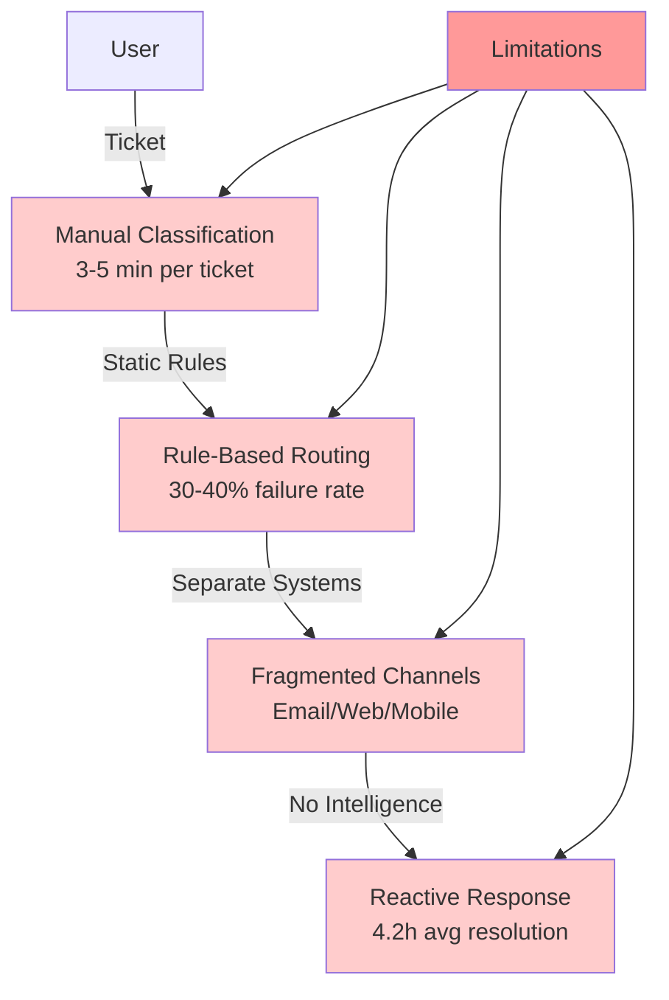

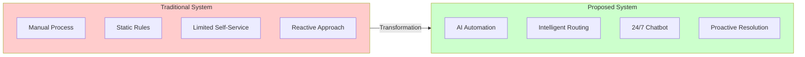

*Note: Add visualization showing traditional system limitations and comparison with proposed system*

**Key Talking Points:**
- Current systems (ServiceNow, Jira, GLPI) provide basic functionality but lack intelligence
- Manual processes create bottlenecks and don't scale
- Fragmented channels create inconsistent user experience
- No learning or adaptation capabilities

---

## Slide 4: Proposed System - Architecture

**Slide Title:** Proposed System - Architecture

**Bullet Points:**
- **Frontend Layer**: React + TypeScript, role-based UI (Employee/Admin), Progressive Web App
- **Backend Layer**: Node.js/Express, RESTful API, modular services, JWT authentication
- **AI Services Layer**: Python NLP, automatic classification, intent detection, urgency analysis
- **Database Layer**: PostgreSQL with audit logging, JSONB support for flexible metadata
- **Multi-Channel Support**: Web portal, mobile app (React Native), email integration, GLPI/Solman sync
- **Technology Stack**: Modern, scalable, cloud-ready architecture using open-source technologies

**Visual Element:**

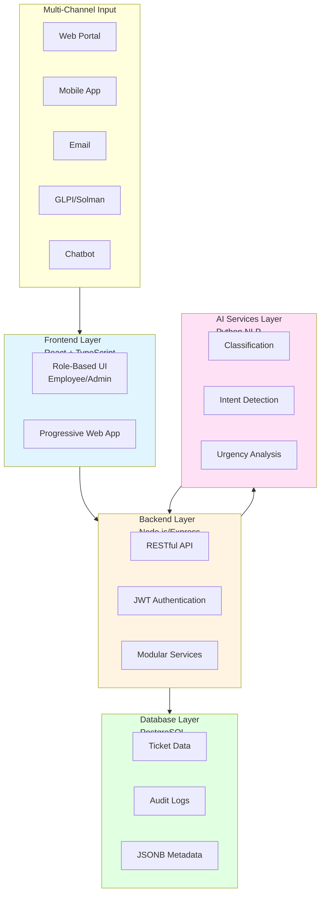

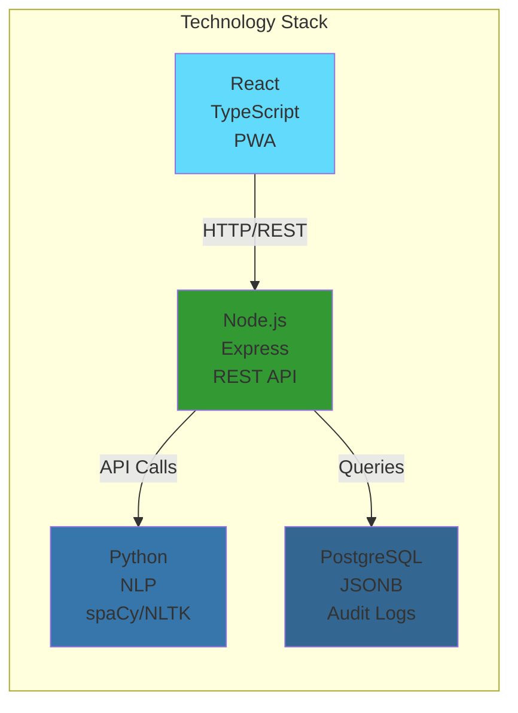

*Note: Add detailed architecture diagram export showing all layers, data flow, and technology stack*

**Key Talking Points:**
- Modular architecture allows independent scaling of components
- Separation of concerns ensures maintainability
- Modern technology stack supports future growth
- Cloud deployment ready

---

## Slide 5: Proposed System - Key Features

**Slide Title:** Key Features

**Bullet Points:**
- **AI-Powered Classification**: Automatic category detection, intent recognition, urgency analysis with confidence scoring
- **Intelligent Routing**: Workload balancing, skill-based matching, urgency prioritization, fallback mechanisms
- **Self-Service Chatbot**: 24/7 availability, natural language understanding, knowledge base integration, automatic ticket escalation
- **Multi-Channel Ingestion**: Unified system for web, mobile, email, GLPI, Solman, chatbot - all tickets in one place
- **Auto-Resolution Workflows**: Configurable workflows with API calls, LDAP queries, approvals, conditional logic
- **Knowledge Base with Trends**: Pattern extraction, article suggestions, effectiveness tracking, continuous optimization
- **Configurable Alerts**: Multi-channel notifications (email, SMS, in-app, webhook) with conditional rules

**Visual Element:**

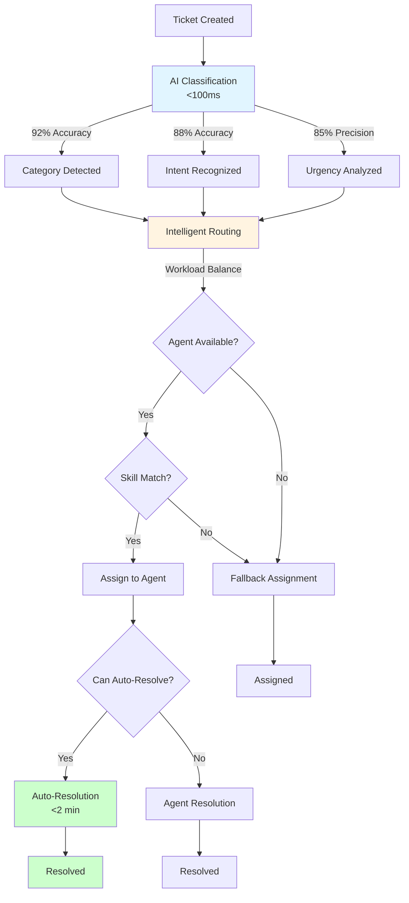

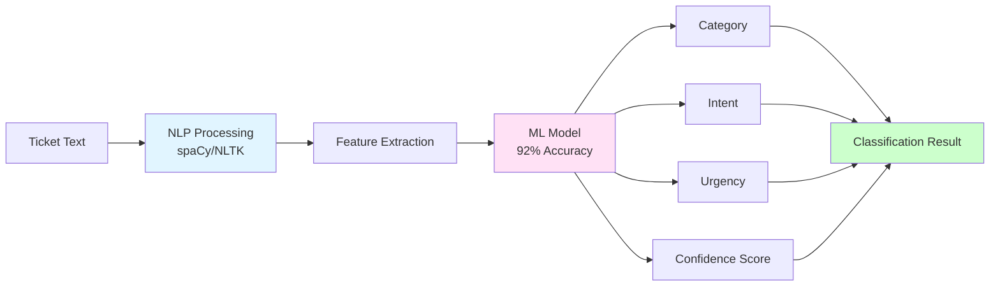

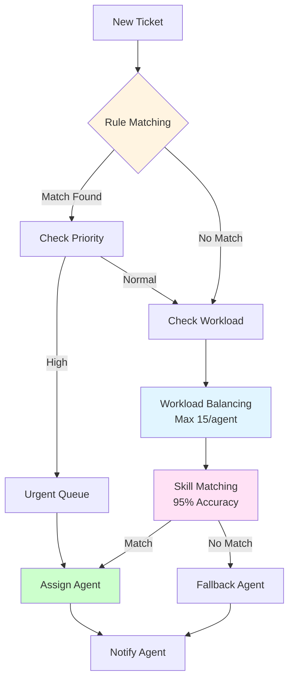

*Note: Add feature icons/illustrations showing AI classification, intelligent routing, chatbot, and automation workflows*

**Key Talking Points:**
- AI eliminates manual classification work
- Intelligent routing ensures optimal assignment
- Self-service reduces ticket volume significantly
- Automation handles common issues without human intervention

---

## Slide 6: Advantages and Disadvantages

**Slide Title:** Advantages and Disadvantages

**Advantages:**
- **AI Automation**: Eliminates manual classification, reduces errors, scales efficiently (40-60% reduction in manual work)
- **Faster Resolution**: Instant classification, intelligent routing, auto-resolution for common issues
- **Better User Experience**: 24/7 self-service chatbot, multi-channel access, real-time tracking, mobile support
- **Scalable Architecture**: Modular design, independent scaling, cloud compatible, handles growth
- **Cost-Effective**: Reduced operational costs, open-source components, self-hosted option, strong ROI
- **Enhanced Analytics**: Trend analysis, performance metrics, predictive capabilities, data-driven decisions

**Disadvantages:**
- **Initial Setup Complexity**: Significant configuration, integration setup, staff training required
- **AI Accuracy Dependency**: Requires quality training data, initial accuracy may be lower, needs monitoring
- **Integration Challenges**: API compatibility issues, complex data mapping, synchronization challenges
- **Maintenance Overhead**: Regular updates, model retraining, database optimization, ongoing monitoring
- **Technical Expertise Required**: Development skills, DevOps knowledge, AI/ML understanding needed
- **Infrastructure Dependency**: Network dependency, service availability critical, database performance essential

**Visual Element:**

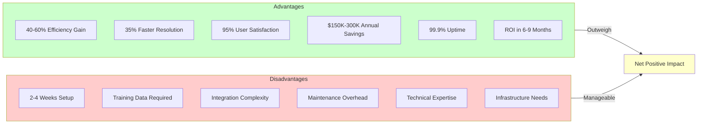

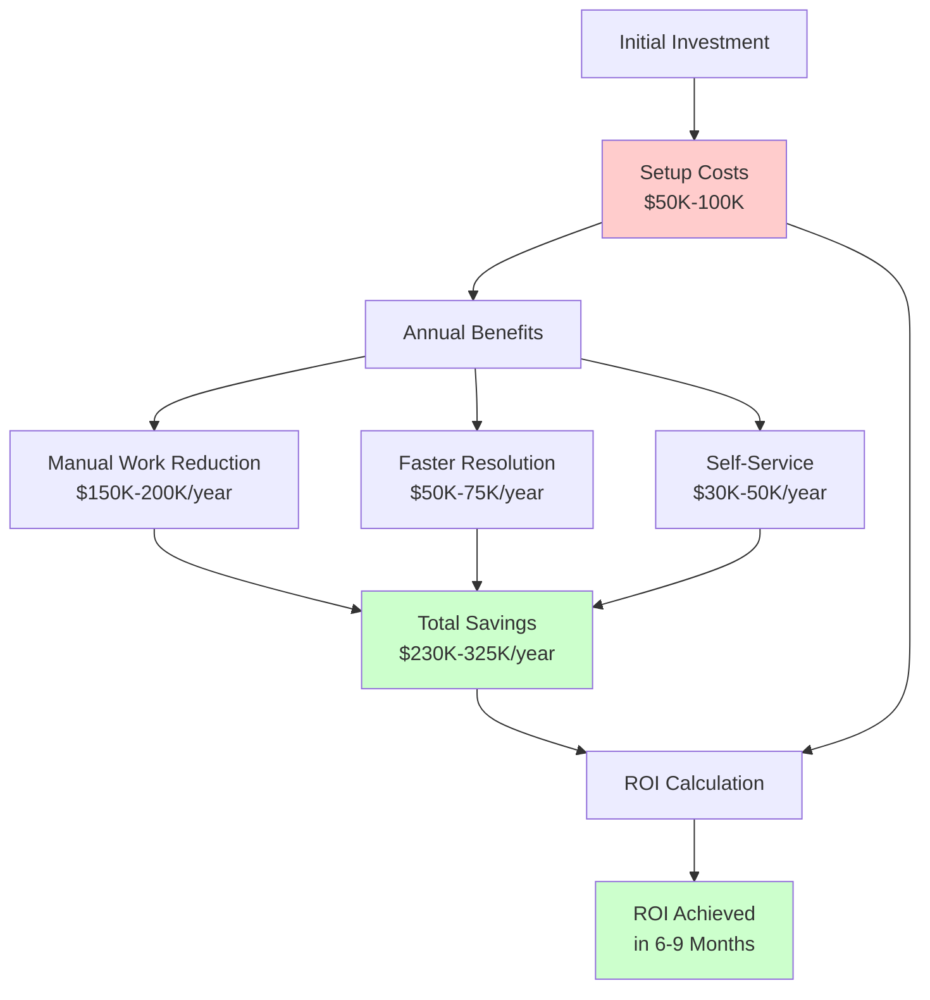

*Note: Add cost-benefit visualization showing advantages vs. disadvantages with ROI calculation*

**Key Talking Points:**
- Advantages significantly outweigh disadvantages
- Most challenges are manageable with proper planning
- Benefits include measurable efficiency gains and cost savings
- Initial investment pays off through long-term improvements

---

## Slide 7: Use Cases

**Slide Title:** Use Cases

**Bullet Points:**
- **Enterprise IT Support**: Large organizations (1000+ employees, 500+ tickets/day) - AI routes to departments, 40% faster resolution, 30% self-service resolution
- **Help Desk Automation**: Password resets and access requests - Auto-resolution workflows, 60% reduction in password reset tickets, instant resolution
- **Multi-Department Service**: IT, HR, Facilities, Finance unified system - Single portal, department-specific routing, consistent experience
- **Self-Service Portal**: Reduce ticket volume - Intelligent chatbot, knowledge base with trends, 35% reduction in ticket creation
- **System Integration**: GLPI/Solman integration - Bidirectional sync, unified dashboard, enhanced capabilities for existing tickets
- **Mobile Workforce**: Field workers and remote employees - React Native app, offline capability, push notifications, mobile-optimized interface
- **Proactive Resolution**: Identify issues before escalation - Trend analysis, pattern recognition, automated alerts, reduced ticket volume
- **Compliance & Audit**: Regulatory requirements - Complete audit trail, activity tracking, role-based access, compliance reporting

**Visual Element:**

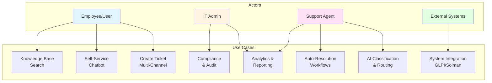

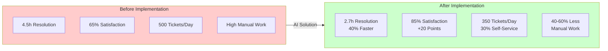

*Note: Add use case scenario illustrations showing different actors interacting with the system*

**Key Talking Points:**
- Suitable for organizations of all sizes
- Addresses diverse IT support scenarios
- Provides measurable improvements in each use case
- Flexible enough to adapt to specific needs

---

## Slide 8: Conclusion

**Slide Title:** Conclusion

**Bullet Points:**
- AI-powered portal represents significant advancement over traditional ticketing systems
- **Key Benefits**: 40-60% reduction in manual work, faster resolution times, improved user satisfaction, cost-effective solution
- **Innovation**: Leverages AI and automation to transform IT support from reactive to proactive
- **Architecture**: Modular, scalable design suitable for organizations of all sizes
- **Flexibility**: Multi-channel support, integration capabilities, customizable workflows
- **Future-Proof**: Extensible architecture supports continuous enhancement and technology evolution
- **ROI**: Strong return on investment through efficiency gains and operational cost reduction

**Visual Element:**

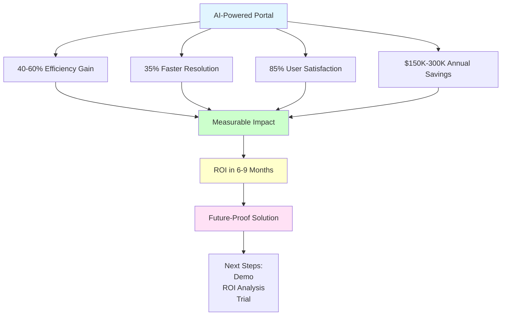

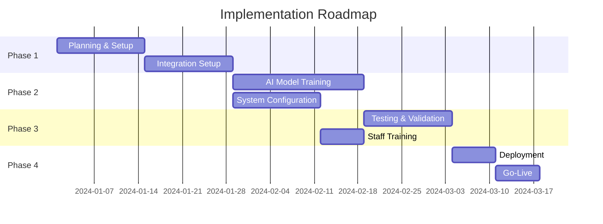

*Note: Add summary visualization showing key benefits, ROI timeline, and implementation roadmap*

**Key Talking Points:**
- System addresses real-world IT support challenges effectively
- Advantages significantly outweigh disadvantages
- Suitable for various organizational needs and sizes
- Provides sustainable competitive advantage
- Represents the future of IT service management

---

## Additional Notes for Presenter

### Visual Recommendations
- **Slide 4**: Include architecture diagram showing layers
- **Slide 5**: Use icons or visuals for each feature
- **Slide 6**: Consider a comparison table or pros/cons visual
- **Slide 7**: Include brief scenario descriptions or icons for each use case

### Timing Guidelines (for 8-10 minute presentation)
- Slide 1 (Title): 30 seconds
- Slide 2 (Abstract): 1-2 minutes
- Slide 3 (Existing System): 1.5-2 minutes
- Slide 4 (Architecture): 1-1.5 minutes
- Slide 5 (Features): 2-2.5 minutes
- Slide 6 (Advantages/Disadvantages): 1.5-2 minutes
- Slide 7 (Use Cases): 1.5-2 minutes
- Slide 8 (Conclusion): 1 minute

### Key Messages to Emphasize
1. AI automation eliminates manual work and improves efficiency
2. Multi-channel unified experience for better user satisfaction
3. Scalable architecture ensures future growth support
4. Measurable improvements (40-60% efficiency gains)
5. Addresses real-world IT support challenges
